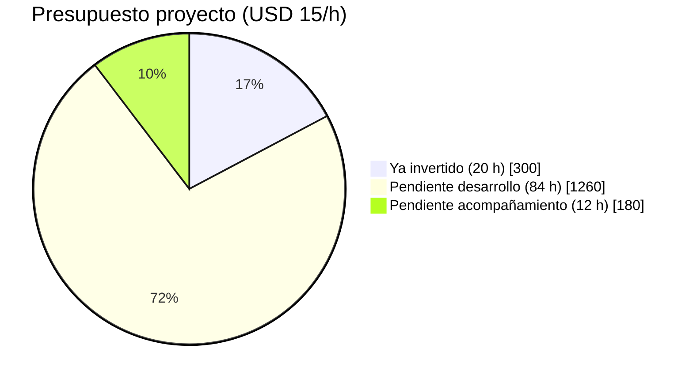
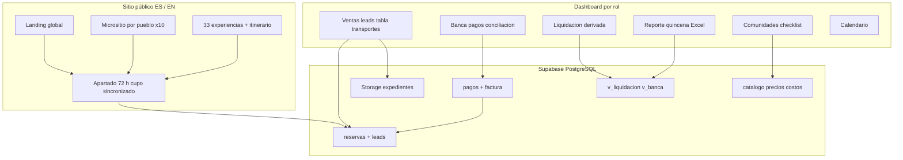
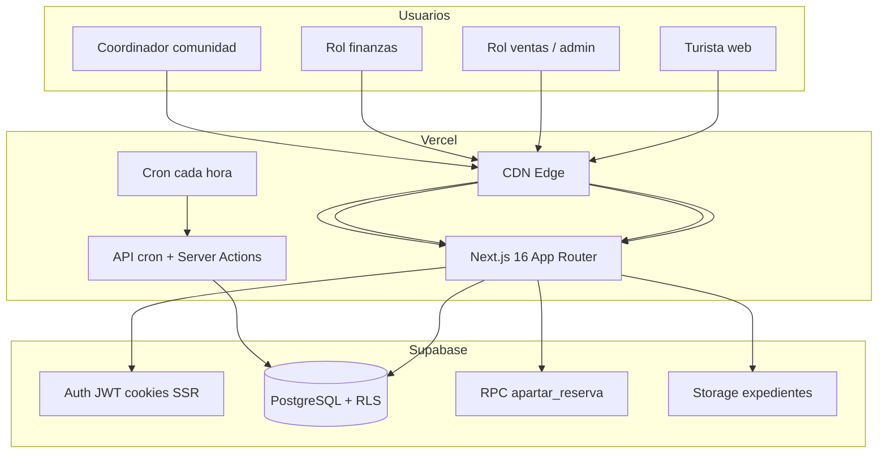
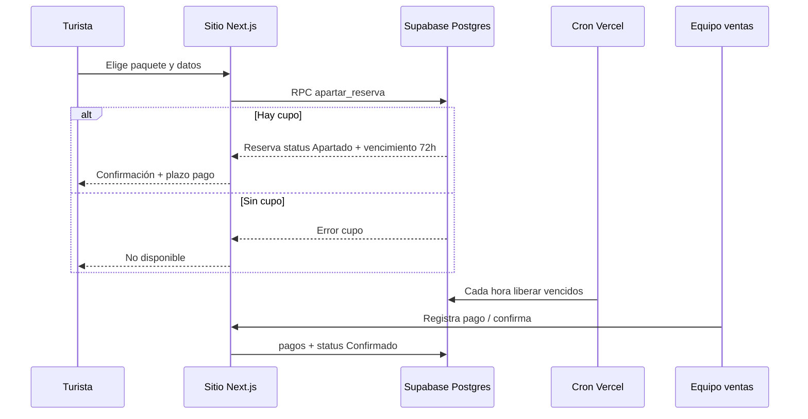
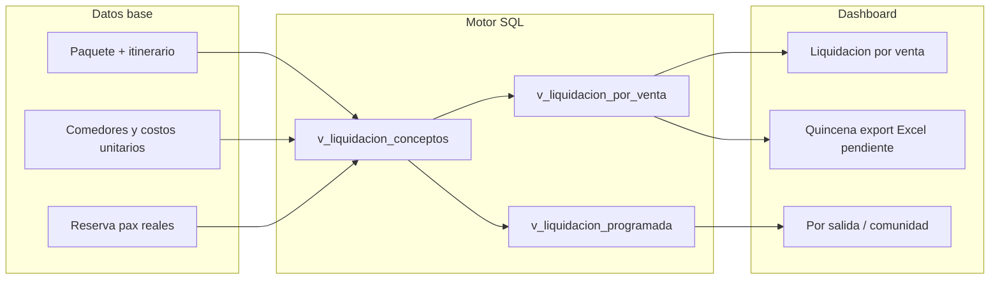
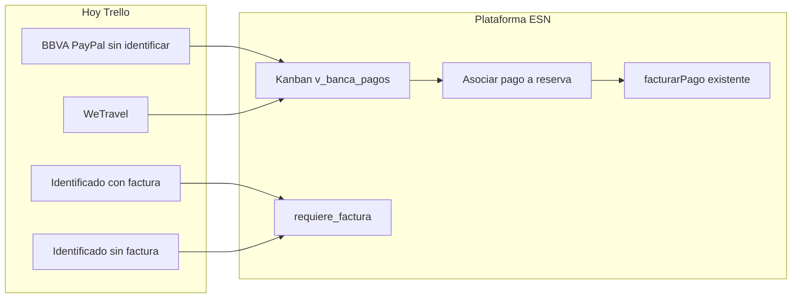
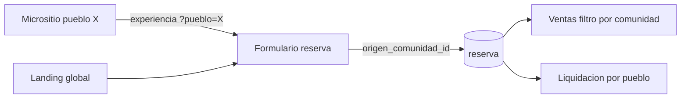
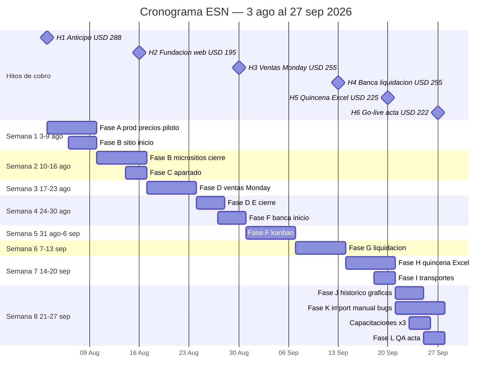
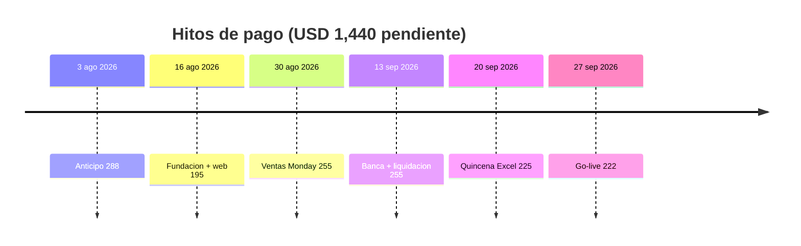
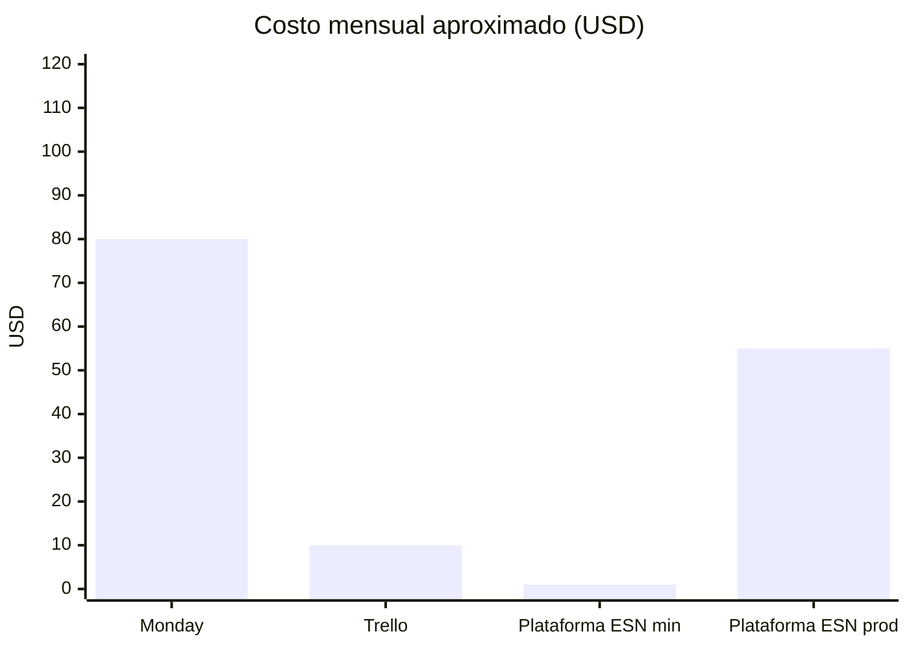

# Expediciones Sierra Norte — Propuesta integral  
## Plataforma única: sitio público + operación (reemplazo Monday, Trello y Excel)

**Cliente:** Cooperativa Expediciones Sierra Norte — Pueblos Mancomunados, Oaxaca  
**Tarifa desarrollo:** **USD 15.00 / hora**  
**Inicio del plan:** **lunes 3 de agosto de 2026**  
**Go-live objetivo:** **domingo 27 de septiembre de 2026** (8 semanas, 12 h/semana)  
**Sitio actual:** [sierra-norte.vercel.app](https://sierra-norte.vercel.app)

Este documento concentra **arquitectura, funcionamiento, plan de trabajo, precios, costos mensuales de servicios, cronograma con fechas, migración Monday y checklist de precios**. No hace falta abrir otros archivos para presentar la propuesta.

---

## 1. Resumen en números



| Concepto | Horas | USD |
|---|---:|---:|
| Ya invertido (sprint reciente en repo, con IA) | 20 | 300 |
| Pendiente — desarrollo | 84 | 1,260 |
| Pendiente — taller, capacitaciones, reuniones | 12 | 180 |
| **Total proyecto hasta go-live** | **116** | **1,740** |
| **Por cobrar ahora (pendiente)** | **96** | **1,440** |

| OPEX mensual (operación normal) | USD/mes |
|---|---:|
| Vercel Pro + Supabase Pro + dominio (+ email opcional) | **46–67** |
| Escenario mínimo (Hobby + Free) | **~1** (no recomendado en temporada) |

**Metodología:** horas realistas con desarrollo asistido por IA (~20 h para el avance actual del repo). Textos/fotos de pueblos y validación contable son principalmente responsabilidad de la cooperativa.

---

## 2. Visión del producto



**Principios**

1. **Una sola fuente de verdad:** Postgres; Monday/Trello/Excel dejan de capturar datos duplicados.  
2. **Liquidación derivada:** no hay tabla “liquidación” manual; se calcula desde catálogo + pax reales.  
3. **Diez pueblos, un sistema:** mismo backend; rol `comunidad` ve solo su `comunidad_id`.  
4. **Apartado global = apartado micrositio:** misma RPC `apartar_reserva`, mismo cupo.

---

## 3. Arquitectura técnica

### 3.1 Capas e infraestructura



### 3.2 Stack tecnológico

| Capa | Tecnología |
|---|---|
| UI | React 19, Tailwind CSS 4 |
| Aplicación | Next.js 16.2 (App Router, Server Components, Server Actions) |
| Base de datos | PostgreSQL en Supabase (21 migraciones SQL, triggers, enums) |
| Autenticación | Supabase Auth + `@supabase/ssr` |
| Archivos | Supabase Storage (bucket `expedientes`) |
| Hosting | Vercel (previews, producción, cron en `vercel.json`) |
| IA en producción | **Ninguna** (opcional futuro, ver sección 10) |

### 3.3 Módulos y rutas

| Módulo | Usuario | Rutas / piezas |
|---|---|---|
| Sitio ES | Público | `/`, `/experiencias/[id]`, `/pueblos/[id]`, `/region`, `/proyecto`, `/equipo` |
| Sitio EN | Público | `/en/*` (equivalente) |
| Reserva web | Público | `ReservaForm`, `acciones-web.ts` → RPC |
| Ventas | ventas, admin | `/ventas` — Panel, Clientes, Paquetes, Tabla, Leads, Transportes |
| Liquidación | finanzas, admin | `/liquidacion` — por venta, salida, comunidad |
| Banca | finanzas, admin | `/banca` — pagos, resumen, contabilidad |
| Calendario | varios | `/calendario` |
| Comunidades | comunidad, admin | `/comunidades/[id]` checklist |
| Admin | admin | `/admin` — usuarios, import CSV precios |

### 3.4 Roles y permisos (RLS)

| Rol | Ve | Escribe |
|---|---|---|
| **admin** | Todo | Todo |
| **ventas** | Pipeline, leads, transportes, catálogo | Reservas, paquetes, leads |
| **finanzas** | Banca, liquidación, cobros | Pagos, flags liquidación |
| **comunidad** | Operación y liquidación de **su** pueblo | Checklist, gastos locales |

---

## 4. Cómo funciona la plataforma (flujos visuales)

### 4.1 Apartado 72 horas (turista → ventas)



### 4.2 Liquidación derivada (sin reescribir Excel)



**Idea clave:** cuando finanzas actualiza un costo en el catálogo, la próxima consulta recalcula; no hay fórmulas rotas en Google Sheets.

### 4.3 Banca — reemplazo de Trello (objetivo Fase F)



Depósito confirmado en Banca puede disparar (ya en BD) paso de **Apartado** → **Confirmado** vía trigger en pagos.

### 4.4 Micrositio → misma operación



---

## 5. Reemplazo Monday + Trello + Excel

### 5.1 Monday → módulos

| Tablero Monday | Plataforma | Estado |
|---|---|---|
| Leads | Ventas → Leads + form micrositio | Hecho (base) |
| Ventas ganadas | Ventas → Panel + Tabla | ~80 % — faltan columnas |
| Histórico | Ventas → Histórico + KPIs | Pendiente Fase J |
| Liquidaciones | Liquidación + «listo captura» | Pendiente Fase G |
| Ventas perdidas | Leads perdido + motivo | Hecho (base) |
| Cobros comunidad | Liquidación + reporte mes | Pendiente Fase G |
| Expediente | Reserva → Expediente Storage | Hecho (base) |
| Transportes | Ventas → Transportes | Hecho (vista) |

**Columnas Monday aún pendientes en `reservas` (Fase D):**

| Monday | Campo propuesto |
|---|---|
| Idioma tour ES/EN | `idioma_tour` |
| Privado / Abierto | `tipo_tour` |
| Anfitrión por salida | `anfitrion_nombre` o FK guía |
| Nueva venta / Liquidar | `estado_admin` |

### 5.2 Trello → Banca (Fase F)

| Lista Trello | En plataforma |
|---|---|
| Sin identificar | Kanban columna 1 |
| Identificado + factura | Columna 3 + `requiere_factura` |
| Identificado sin factura | Columna 2 |
| Cerrado | Columna 4 |

### 5.3 Excel quincenal → Liquidación (Fase H)

| Excel | Plataforma |
|---|---|
| Hoja por comunidad + fechas | Pantalla Quincena (filtros) |
| Efvo vs Fact | Filtros `metodo_pago` / factura |
| servicio × unitario × cantidad | Vista derivada + export `.xlsx` |
| Validación Amatlán | Comparación 1 quincena piloto |

---

## 6. Qué ya está hecho (~20 h)

| Entregable | Estado |
|---|---|
| Migraciones 20–21 en repo (`20_enum_apartado`, `21_plan_producto`) | Falta aplicar en **producción** |
| Sitio bilingüe, 33 paquetes, SEO, favicon | En producción |
| 10 micrositios plantilla ES/EN | En producción — falta copy/fotos |
| Apartado + cron `/api/cron/liberar-apartados` | En producción |
| Tabla ventas, leads, transportes, expediente, import precios | En producción |
| Liquidación / Banca / Calendario / Comunidades | Base en producción |

---

## 7. Plan de trabajo pendiente (tareas y horas)

| Fase | Nombre | h dev | h acomp. | Entregable |
|:---:|---|---:|---:|---|
| **A** | Puesta en marcha prod | 5 | 2 | DB prod, precios, 3 reservas piloto |
| **B** | Sitio y micrositios | 6 | 0 | CTAs, carga descripciones pueblos |
| **C** | Apartado pulido | 5 | 0 | Alertas dashboard, email opcional |
| **D** | Ventas ≈ Monday | 10 | 0 | idioma, tipo, anfitrión, filtros, estado_admin |
| **E** | Leads | 1.5 | 0 | Motivo perdida, filtros |
| **F** | Banca ≈ Trello | 11 | 0 | Kanban, factura, CSV banco |
| **G** | Liquidación ops | 6 | 0 | Listo captura, cobros comunidad/mes |
| **H** | Quincena Excel | 12 | 0 | UI + export + validación Amatlán |
| **I** | Transportes / expediente | 2.5 | 0 | Permisos Storage, UX |
| **J** | Histórico y gráficas | 10 | 0 | Año, KPIs, ventas/mes, calendario filtros |
| **K** | Go-live | 12 | 10 | Import Monday, manual PDF, bugs, 3 capacitaciones, reuniones |
| **L** | Cierre QA | 3 | 0 | Regresión + acta |
| | **Total** | **84** | **12** | **96 h** |

### Detalle por fase

**A — Puesta en marcha (5 + 2 h)**  
A1 Migraciones 20–21 prod + smoke (1.5) · A2 Cron `CRON_SECRET` (0.5) · A3 CSV precios/costos + 3 reservas piloto (1.5) · A4 Checklist precios con finanzas (1.5) · A5 Taller precios reunión (2)

**B — Sitio (6 h)**  
B1 Limpieza `public/` legacy + CTAs (2) · B2 Carga `descripcion` / `descripcion_en` (2) · B3 Enlaces global ↔ pueblos (2)

**C — Apartado (5 h)**  
C1 Badge apartados por vencer (2) · C2 Email Resend opcional (3)

**D — Ventas Monday (10 h)**  
D1 Campos BD + UI idioma/tipo/anfitrión (4) · D2 Filtros + CSV (3) · D3 `estado_admin` (3)

**E — Leads (1.5 h)**  
E1 Perdidas y filtros (1.5)

**F — Banca (11 h)**  
F1 Kanban (6) · F2 `requiere_factura` (1.5) · F3 Import CSV movimientos (3.5)

**G — Liquidación (6 h)**  
G1 Listo para captura (3) · G2 UI cobros comunidad/mes (3)

**H — Quincena (12 h)**  
H1 Pantalla rango + comunidad (6) · H2 Export xlsx (4) · H3 Validación vs Excel referencia (2)

**I — (2.5 h)** · **J — (10 h)** · **K — (12 + 10 h)** · **L — (3 h)**

---

## 8. Cronograma con fechas exactas

**Ritmo:** 12 horas de trabajo por semana (lunes a domingo).  
**Kickoff:** **3 ago 2026 (lun)** · **Acta go-live:** **27 sep 2026 (dom)**

### 8.1 Diagrama de Gantt



### 8.2 Calendario semanal (fechas y foco)

| Semana | Del | Al | Horas | Fases | Entregable demo |
|:---:|---|---|---:|---|---|
| 1 | **lun 3 ago 2026** | dom 9 ago | 12 | A, B | Prod con migraciones; precios piloto |
| 2 | lun 10 ago | dom 16 ago | 12 | B, C | CTAs + alertas apartado; **Hito 2** |
| 3 | lun 17 ago | dom 23 ago | 12 | D | Columnas Monday en reserva |
| 4 | lun 24 ago | dom 30 ago | 12 | D, E, F | Tabla filtros; kanban inicio; **Hito 3** |
| 5 | lun 31 ago | dom 6 sep | 12 | F | Trello en pantalla |
| 6 | lun 7 sep | dom 13 sep | 12 | G | Listo captura + cobros comunidad; **Hito 4** |
| 7 | lun 14 sep | dom 20 sep | 12 | H, I | Quincena export; **Hito 5** |
| 8 | lun 21 sep | **dom 27 sep** | 12 | J, K, L | Histórico, import Monday, acta; **Hito 6** |

### 8.3 Reuniones y capacitaciones (fechas propuestas)

| Fecha | Evento | Duración |
|---|---|---|
| **lun 3 ago 2026** | Kickoff + firma anticipo | 1 h |
| **mié 6 ago 2026** | Taller precios (Fase A5) | 2 h |
| **mié 17 sep 2026** | Reunión validación quincena vs Excel | 1 h |
| **mar 23 sep 2026** | Capacitación ventas | 2 h |
| **jue 25 sep 2026** | Capacitación finanzas | 2 h |
| **vie 26 sep 2026** | Capacitación comunidades | 2 h |
| **dom 27 sep 2026** | Acta de aceptación go-live | 1 h |

Reuniones de seguimiento quincenales: **13 ago**, **27 ago**, **10 sep**, **24 sep 2026** (1 h c/u, incluidas en acompañamiento).

### 8.4 Línea de tiempo de cobros



---

## 9. Precios, hitos y forma de pago

**Tarifa:** USD **15.00 / hora** (IVA/retención MX según régimen, por acordar).

| # | Hito | Fecha límite | Horas | USD | Condición |
|:---:|---|---|---:|---:|---|
| 1 | Anticipo (20 %) | 3 ago 2026 | 19 | **288** | Firma + acceso Supabase prod |
| 2 | Fundación + web | 16 ago 2026 | 13 | **195** | Migraciones OK + CTAs |
| 3 | Ventas Monday | 30 ago 2026 | 17 | **255** | Demo columnas y filtros |
| 4 | Banca + liquidación | 13 sep 2026 | 17 | **255** | Kanban conciliación usable |
| 5 | Quincena Excel | 20 sep 2026 | 15 | **225** | 1 quincena validada |
| 6 | Go-live | 27 sep 2026 | 15 | **222** | Acta firmada |
| | **Total pendiente** | | **96** | **1,440** | |

**Sugerencia:** transferencia internacional o SPEI en MXN a tipo de cambio del día; **15 días** netos por hito.

**Retainer post go-live (opcional):**

| Nivel | h/mes | USD/mes |
|---|---:|---:|
| Soporte estándar | 6 | 90 |
| Temporada alta | 8 | 120 |

**Fuera de alcance (nuevo contrato):** API BBVA, webhooks WeTravel/PayPal, CFDI, app móvil, multi-cooperativa.

---

## 10. Costos mensuales de la plataforma (OPEX)

La app **no consume IA** en producción hoy.

### 10.1 Operación recomendada (temporada)

| Servicio | Plan | USD/mes | Notas |
|---|---|---:|---|
| Vercel | Pro | 20 | Cron apartados, ancho de banda, previews |
| Supabase | Pro | 25 | Backups, Storage expedientes, sin pausa |
| Dominio | anual prorrateado | 1–2 | .com / .mx |
| Resend (opcional) | Free–Starter | 0–20 | Emails apartado |
| **Total típico** | | **46–67** | |

### 10.2 Escenario mínimo

Vercel Hobby + Supabase Free ≈ **USD 1/mes** — riesgo: límites de cron, DB y Storage.

### 10.3 Comparativa herramientas actuales vs plataforma



*(Monday: rango 40–120 según asientos; barra 80 es referencia media.)*

### 10.4 IA opcional (futuro, no incluida en desarrollo)

| Uso | Costo orientativo USD/mes |
|---|---:|
| Borradores textos EN micrositios | 5–25 |
| Asistente interno sobre manual | 15–40 |
| **Recomendación** | Postergar hasta después del 27 sep 2026 |

---

## 11. Checklist — validación precios y liquidación (Fase A)

Usar después de cargar tarifas y costos en catálogo.

**Antes de empezar**

- [ ] Migraciones `20_enum_apartado.sql` y `21_plan_producto.sql` aplicadas en Supabase producción (en ese orden).
- [ ] CSV de precios completado (plantilla abajo) subido en **Admin → Importar precios**.
- [ ] En **Ventas → Paquetes**, paquete piloto con comedores e ítems liquidables con costo > 0 donde aplique.

**Tres reservas de prueba**

| # | Escenario | Qué revisar |
|---:|---|---|
| 1 | 4 pax, 2 días, efectivo | Liquidación comedores × 4; margen Banca |
| 2 | 2 pax, WeTravel | Pago en Banca → Liquidación Cobros |
| 3 | Pago mixto en comunidad | Reparto cuadra con precio total |

**Criterios de aceptación Fase A**

- [ ] Sin conceptos liquidables en $0 sin justificación (paquete piloto).
- [ ] `v_liquidacion_conceptos` con totales > 0 en salida piloto.
- [ ] KPIs vendido/cobrado/por cobrar = pagos confirmados.
- [ ] Rol comunidad ve su pueblo sin datos bancarios ajenos (RLS).

**Plantilla CSV precios** (columnas `id,precio`; IDs `p01`…`p33`):

```csv
id,precio
p01,0
p02,0
p03,0
```

---

## 12. Migración Monday → Postgres (Fase K1)

Matriz para import one-shot CSV exportado desde Monday.

| Monday (Ventas ganadas) | Destino |
|---|---|
| Nombre cliente | `reservas.nombre` |
| Estado | `reservas.status` — Reservado→Apartado/Planeación, Ganado→Confirmado, En viaje→En Curso |
| Agente | `reservas.agente_id` |
| Pax | `reservas.personas` |
| Nacionalidad | `reservas.nacionalidad` |
| Paquete | `reservas.paquete_id` (p01…p33) |
| Archivo itinerario | Storage `expedientes` + `reserva_adjuntos` |
| Fechas | `fecha_inicio`, `fecha_fin` |

| Monday Leads | `leads` (nombre, email, teléfono, paquete_id, estado) |
| Monday perdidas | `leads.estado = perdido` + `motivo_perdida` |
| Cobros comunidad | `pagos` método Pago en comunidad |
| Transportes | `reservas.transporte` + `v_transportes_salidas` |
| Liquidaciones históricas | Solo referencia; operación nueva usa `v_liquidacion_*` |

---

## 13. Definition of Done (27 sep 2026)

1. Sitio + 10 micrositios con contenido acordado; apartado con cupo real.  
2. Ventas sustituye Monday ganadas (idioma, tipo tour, anfitrión, estados admin).  
3. Banca sustituye Trello (kanban + factura).  
4. Quincena exportable validada vs Excel referencia.  
5. Precios/costos reales cargados.  
6. Histórico + gráfica ventas/mes.  
7. Import Monday + 3 capacitaciones + estabilización acotada.  
8. Manual PDF + acta firmada el **27 sep 2026**.

---

## 14. Responsabilidades cooperativa vs desarrollo

| Responsabilidad | Quién |
|---|---|
| Tarifas, costos comedores/servicios CSV | ESN / finanzas |
| Textos y fotos 10 pueblos | ESN marketing |
| Export CSV Monday + Excel quincena Amatlán referencia | ESN administración |
| Usuario decisor y acceso Supabase prod | ESN |
| Implementación técnica, despliegue, capacitación | Desarrollo |
| Validación checklist precios | Finanzas + desarrollo |

---

## 15. Riesgos y mitigación

| Riesgo | Mitigación |
|---|---|
| Tarifas tardías | Hito 2 no cierra sin CSV precios |
| Copy pueblos lento | 3 pueblos piloto al 16 ago; resto en paralelo cliente |
| Finanzas sigue Excel | Fecha corte Monday acordada en kickoff 3 ago |
| Scope WeTravel automático | Change request aparte |

---

*Documento único — julio 2026. Proyecto: **116 h** total (**20** hechas + **96** pendientes). Inicio **3 ago 2026**, go-live **27 sep 2026**. OPEX **~USD 46–67/mes**.*
