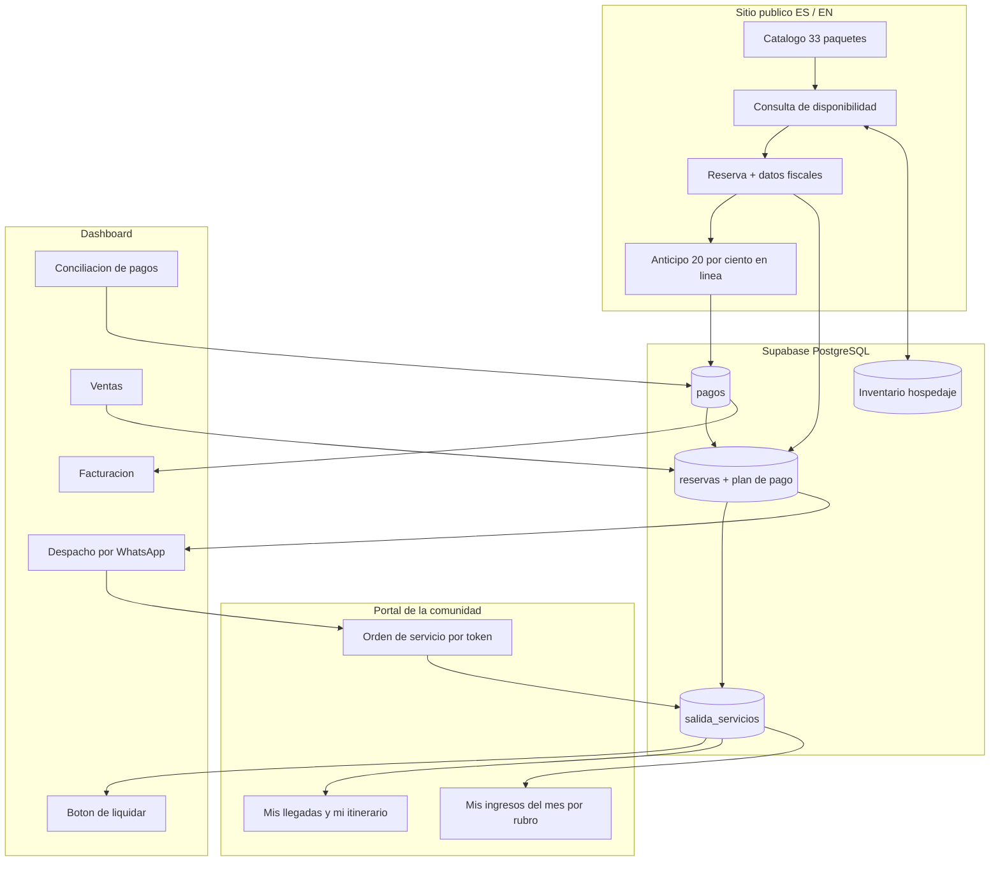

# Expediciones Sierra Norte — Anexo técnico (v8)
## Detalle de la propuesta en diapositivas

**Cliente:** Cooperativa Expediciones Sierra Norte — Pueblos Mancomunados, Oaxaca
**Paquete único:** **$40,000 MXN** · 329 h · anticipo de $10,000 + 3 mensualidades de $10,000
**Sin etapa 2:** todo el alcance va incluido — agente de WhatsApp, panel fiscal, timbrado e historial
**Arranque tentativo:** lunes 17 de agosto de 2026, al confirmar Sierra Norte · **Cierre:** domingo 15 de noviembre de 2026
**Ritmo:** **~24 h/semana** · 13 semanas · entrega en producción cada mes
**Sitio actual:** [sierra-norte.vercel.app](https://sierra-norte.vercel.app)

> **Cómo se usa este documento.** La presentación (`docs/presentacion/propuesta-esn.html`, 20
> diapositivas) es lo que se muestra en la reunión. Este anexo es el detalle técnico: qué se
> toca en la base de datos, qué tablas y vistas nuevas hacen falta y el desglose de horas.
> Los números de los dos documentos son los mismos; si cambia uno, cambia el otro.

### Qué cambió en la v6

**Arquitectura de varios sitios.** La propuesta ya no es «un sitio con micrositios», sino
**una plataforma con varias fachadas**:

| Fachada | Cuántos | Quién es |
|---|---:|---|
| Expediciones Sierra Norte | 1 | La marca que vende los viajes, ES/EN |
| Pueblos Mancomunados | 1 | **Nuevo** — la casa común de las comunidades |
| Página de cada pueblo | 8 | Con su logo, sus fotos y sus experiencias |
| **Plataforma de gestión** | 1 | **La administra Sierra Norte**; aquí se concentra todo |

Las diez fachadas leen y escriben contra **el mismo catálogo y el mismo calendario**: una
reserva hecha en la página de Latuvi descuenta el inventario en todas las demás al instante,
y aterriza en la plataforma con su folio y su `origen`. Técnicamente es **una sola app y una
sola base**, con enrutamiento por dominio — no diez proyectos separados.

**WhatsApp automático en el alcance base.** Antes era opcional. Ahora es
un eje de la propuesta: envío al confirmarse el anticipo, recordatorio 3 días antes, aviso de
cambios, insistencia si no hay acuse, y bitácora de lo enviado. Requiere WhatsApp Cloud API,
un número a nombre de la cooperativa y plantillas aprobadas por Meta (**el trámite tarda: se
inicia la semana 1**). Tiene costo por mensaje, aparte del OPEX.

**Se quitaron las comparaciones «antes / ahora» de la presentación.** Al cliente le resultaban
presuntuosas: la cooperativa ya opera bien. El deck ahora sólo enuncia la solución, con
énfasis en **velocidad**. Este anexo conserva el detalle técnico.

**Logos y material audiovisual** entran como requisito explícito: logo de Sierra Norte, de
Pueblos Mancomunados y de cada uno de los 8 pueblos, más fotos, video y texto propios de cada
comunidad. Lo aporta la cooperativa.

### Nuevo en la v7

**Agente de WhatsApp (dentro del paquete · 36 h).** Un agente conversacional en el WhatsApp de
entrada que califica al prospecto, consulta **cupo y hospedaje reales**, propone sólo los
paquetes que sí caben y aparta 72 h con la misma RPC que la web. El prospecto cae en
`leads` con la conversación completa y **ventas confirma a mano antes de cobrar**: el agente
no cierra ventas ni cobra.

```
conversaciones      (id, telefono, canal, estado, lead_id, resumen, created_at)
conversacion_turnos (id, conversacion_id, rol, texto, herramienta, payload, created_at)
```

Desglose: webhook de WhatsApp entrante y manejo de conversación 8 h · agente con acceso al
catálogo y a `disponibilidad()` por tool-calling 12 h · creación de prospecto y apartado
tentativo 6 h · bandeja en el panel de ventas y traspaso a persona 6 h · pruebas y ajuste
del guion 4 h.

**Implica IA en producción**, que hasta ahora no había. Costo aparte del OPEX: entre **$300
y $800 MXN/mes** según volumen de conversaciones. Se enciende al final del proyecto a propósito — el agente sólo sirve si el catálogo y la
disponibilidad ya están al día.

**Portada mejorada (hecho en este repo).** La sección de comunidades de la landing ahora dice
«N pueblos, cada uno con su sitio» y cada tarjeta lleva un botón visible **«Ver su sitio →»**
(`pueblosSitio` en `src/lib/i18n/index.ts`, ES y EN). Las tarjetas subieron de `h-40` a `h-48`
para que quepa. Verificado con `tsc` y en local. **Falta desplegarlo.**

**Capturas del dashboard.** Ya hay dos reales en la presentación: la tabla de reservas y el
alta de reserva. Falta una de liquidación o de banca.

### Un solo lenguaje visual (hecho en este repo)

El cliente notó un riesgo real: la presentación muestra pantallas con un diseño que la
aplicación no tenía. Si el deck promete una imagen y el producto entrega otra, se ve mal.

**Diagnóstico.** El sitio público ya usaba el verde de marca (`#1F7D5E`, `#0F3D2E`). El
tablero interno era gris + esmeralda, pero con un **acento violeta** (`#5B21B6` y `#4C1D95`)
que desentonaba con todo lo demás.

**Hecho:** se sustituyó el violeta por el verde de marca en toda la aplicación —
90 reemplazos en `src/app/(dash)`, `src/components`, `src/lib`, `src/app/login` e
`src/app/inicio`, incluidos los tintes `violet-50/100/200` → `emerald-*`. Verificado con
`tsc` y en local. Se dejó intacta la paleta `AVATAR_COLORS` de `src/lib/tipos.ts`, que sí
debe variar por cliente. **Falta desplegarlo.**

**Pendiente de decidir — armonización completa (~32 h).** El color ya cuadra, pero para que
el tablero se vea igual que la presentación falta la tipografía, los radios, las sombras y
los componentes base:

| Tarea | h |
|---|---:|
| Tokens compartidos (color, tipografía, radios, sombras) en `globals.css` | 6 |
| Componentes base del tablero: botones, tarjetas, tablas, píldoras, modales, formularios | 12 |
| Pasar las pantallas existentes: ventas, banca, liquidación, calendario, comunidades, admin | 10 |
| Alinear el sitio público a los mismos tokens | 4 |
| **Total** | **32** |

**Lo que no cuesta nada:** las pantallas nuevas (botón de liquidar, portal de comunidad,
panel fiscal, agente) **se construyen directamente en el diseño de la presentación**. El
costo de 32 h es sólo por rehacer la piel de lo que ya existe.

Con esas 32 h el paquete pasaría de 329 a **361 h**, es decir **~$111/hora** y **~26 h/semana**.
Es la primera candidata a recortar si el ritmo no se sostiene: se puede hacer una versión
ligera (sólo tokens y botones, ~14 h) que ya acerca mucho sin rehacer pantallas.

### La decisión tomada: todo incluido, $40,000, en 3 meses

Se planteó dos veces que el alcance no cabía en el precio y se ofrecieron alternativas
(alargar a diciembre, subir el precio, o dejar parte para una segunda etapa). **El
desarrollador decidió meter todo el alcance en $40,000 cerrando el 15 de noviembre.**
Queda registrado con sus números reales:

| | |
|---|---:|
| Alcance total | **329 h** |
| Ya invertido y en producción | 20 h |
| Pendiente | **309 h** |
| Plazo | 13 semanas (17 ago – 15 nov 2026) |
| **Ritmo real necesario** | **~24 h/semana** |
| Precio | $40,000 MXN |
| **Tarifa efectiva** | **~$122/hora** (≈ 6.5 USD/h) |

Contra la referencia inicial de $186/h, son **$64/hora menos**. Y 24 h/semana durante trece
semanas seguidas es prácticamente una jornada de medio tiempo. **Es una decisión comercial
consciente**, tomada con los números a la vista, no un error de estimación.

**Lo que ya no queda por vender.** Al meter todo en el paquete, no hay módulos de segunda
etapa que cotizar después. El ingreso posterior sale del **retainer de soporte**
($1,100–$1,900/mes) y de lo que se cotice como nuevo a partir del acta.

**Plan B acordado de antemano.** Si el ritmo no se sostiene, se recorre el calendario a 18
semanas y se cierra a más tardar el 27 de diciembre, con el mismo precio y el mismo alcance.
Queda escrito en la cláusula 6 del acuerdo de colaboración, no se anuncia sobre la marcha.

**Riesgo que hay que vigilar.** El panel fiscal depende de datos que hoy no existen: cuáles
son exactamente las ocho comunidades, su RFC y su régimen. Si eso no llega al arranque, esa
fase se atora aunque todo lo demás avance. Es el primer punto del kickoff.

**Fechas tentativas.** El arranque del 17 de agosto está sujeto a que Sierra Norte confirme
la colaboración y firme. Si la confirmación llega después, todas las fechas se recorren la
misma cantidad de días (cláusula 6 del acuerdo).

---

### Qué cambió en la v5

**Corrección de encuadre.** La cooperativa **ya tiene reservas en línea funcionando**. Las
versiones anteriores lo planteaban como si hubiera que construirlo. El problema real es
otro y es más acotado:

1. La solicitud del sitio **no entra sola al control interno** — alguien la recaptura.
2. **No se puede cobrar sólo el 20 % de anticipo**: se manda un enlace de PayPal, que es
   todo o nada y con una de las comisiones más caras del mercado.
3. La disponibilidad **se cruza aparte**, fuera del sistema.

**Bug corregido en este repo.** `src/proxy.ts` no incluía `/pueblos` en la lista de rutas
públicas: los 10 micrositios estaban enlazados desde la portada **y declarados en
`sitemap.ts` para Google**, pero al abrirlos redirigían a `/login`. Se agregó
`sinIdioma.startsWith('/pueblos')`. Verificado en local: `/pueblos/cuajimoloyas` pasó de
307 a 200. **Falta desplegarlo a producción.**

**Micrositios.** Pasan a ser un eje de la propuesta: 8 páginas (una por pueblo mancomunado,
más 2 comunidades aliadas ya cargadas), todas contra el mismo catálogo y el mismo cupo, y
cada reserva guarda de qué micrositio salió.

**Contenido audiovisual.** Hoy los micrositios repiten las mismas fotos entre experiencias.
El material propio de cada pueblo —fotos, video y texto— **lo aporta la cooperativa**; queda
en la lista de responsabilidades y no cambia el precio.

Además, en la ronda anterior se agregaron cuatro cosas y se reordenó todo:

1. **Botón de liquidación por comunidad y fecha**, con método de pago, descuento, monto y
   export a Excel para cotejar.
2. **Los servicios de la salida son editables.** El paquete es el plan; el viaje es lo que
   pasó. Cambio de fondo en el modelo — ver §3.
3. **Usuario propio para cada comunidad**, que ve sólo su itinerario, sus clientes, sus
   fechas y **sus ingresos del mes por rubro**.
4. **El aviso por WhatsApp lo dispara reservaciones** una vez confirmado el anticipo.

**Precio:** se pasa de tarifa por hora a **precio cerrado en pesos** ($40,000 + $12,000
opcional), que equivale a ~$186 MXN/hora — la misma tarifa de referencia de la v2, sin
riesgo de tipo de cambio para la cooperativa.

**Orden de trabajo:** se entregan primero los dos dolores más grandes —el aviso al pueblo y
el botón de liquidar— y se deja el cobro en línea para el segundo mes. Hoy ya cobran, aunque
caro; lo que hoy cuesta trabajo es **armar y mandar el aviso pueblo por pueblo, sin que quede
constancia de que llegó**, y **rehacer la liquidación a mano**.

**Plazo:** cerrar en **3 meses**. Con el alcance final son **309 horas pendientes en 13
semanas**, o sea **~24 h/semana**. No deja holgura alguna: si el taller de precios de la
primera semana se recorre, se recorre todo el calendario. Ver riesgos.

**El panel fiscal** depende del contador y de datos que aún no están definidos (cuáles son
las ocho comunidades, su RFC y su régimen). Va dentro del paquete, pero es la fase con más
riesgo de atorarse.

---

## 1. Resumen en números

| Paquete único — todo incluido | Horas | MXN |
|---|---:|---:|
| Ya invertido y en producción | 20 | — |
| Pendiente — desarrollo | 297 | — |
| Pendiente — capacitaciones y reuniones | 12 | — |
| **Total** | **329** | **$40,000** |

Tarifa implícita: **~$122 MXN/hora**. No hay etapa 2: todo el alcance va en el paquete.

| Costo mensual de operar | MXN/mes |
|---|---:|
| Vercel Pro + Supabase Pro + dominio + correos | **$900 – $1,500** |
| Mensajes de WhatsApp Business | según volumen |
| IA del agente conversacional | **$300 – $800** |
| Escenario mínimo (planes gratuitos) | ~$20 — sin respaldos, no recomendado en temporada |
| Comisiones de la pasarela | variables sobre lo cobrado en línea |

| Soporte después del cierre (opcional) | h/mes | MXN/mes |
|---|---:|---:|
| Estándar | 6 | $1,100 |
| Temporada alta | 10 | $1,900 |

---

## 2. El circuito



**Los cinco principios**

1. **Una sola fuente de verdad.** Postgres. Monday, Trello y Excel dejan de capturar.
2. **El paquete es el plan; `salida_servicios` es lo que pasó.** De ahí sale la liquidación.
3. **Un solo inventario de hospedaje** para todos los paquetes que comparten la misma cama.
4. **Cada comunidad ve lo suyo.** Cambio de política — ver §4.
5. **El permiso vive en la base**, con RLS por renglón y vistas para esconder columnas.

---

## 3. El cambio de fondo: los servicios reales de la salida

Hasta hoy la liquidación se derivaba **del catálogo**: `v_liquidacion_conceptos` unía
comedores, ítems del itinerario, transporte y anfitrión, y multiplicaba por los pax. Eso es
correcto mientras el viaje salga como se vendió — y el cliente dice que **muchas veces no**.
Un grupo cambia la caminata por una van; otro pide una comida extra.

La liquidación ahora se deriva de una **capa intermedia editable** que nace del catálogo:

```sql
-- se puebla al confirmar la reserva, copiando del catálogo; después se edita
create table salida_servicios (
  id              uuid primary key default gen_random_uuid(),
  reserva_id      uuid not null references reservas(id) on delete cascade,
  dia             int  not null default 1,
  fecha           date,                              -- fecha real; alimenta el filtro por rango
  comunidad_id    text references comunidades(id) on delete set null,
  rubro           tipo_liquidacion,                  -- reutiliza el enum que ya existe
  concepto        text not null,
  cantidad        numeric(12,2) not null default 1,
  unitario        numeric(12,2) not null default 0,
  por_persona     boolean not null default false,
  descuento_pct   numeric(5,2)  not null default 0,
  descuento_monto numeric(12,2) not null default 0,
  monto           numeric(12,2) generated always as (
                    round(cantidad * unitario * (1 - descuento_pct/100) - descuento_monto, 2)
                  ) stored,
  origen          text not null default 'catalogo'
                    check (origen in ('catalogo','ajuste','extra')),
  item_ref        uuid,                              -- de qué itinerario_item o comedor nació
  activo          boolean not null default true,     -- false = quitado, con su motivo
  motivo_cambio   text,
  metodo_pago     metodo_pago,                       -- efectivo / transferencia / pago en comunidad
  liquidado       boolean not null default false,
  liquidado_el    timestamptz,
  comprobante_url text,
  prestado        boolean,                           -- lo confirma la comunidad
  cantidad_real   numeric(12,2),                     -- si iban 8 y llegaron 6
  creado_por      uuid references perfiles(user_id) on delete set null,
  created_at      timestamptz not null default now(),
  updated_at      timestamptz not null default now()
);
create index on salida_servicios (comunidad_id, fecha);
create index on salida_servicios (reserva_id);
```

**Función `generar_servicios_salida(reserva_id)`** — copia del catálogo (comedores,
`itinerario_items` con `tipo` no nulo, transporte y anfitrión), multiplicando por los pax
donde `por_persona`. Se dispara al pasar la reserva a `Confirmado` y es idempotente.

**Vista `v_liquidacion_comunidad_fecha`** — agrupa `salida_servicios` activos por comunidad
y fecha, con cliente, rubro, cantidad, unitario, descuento, monto y método de pago. Es la
que alimenta el botón de liquidar y el export.

**Consecuencias que hay que asumir, y son buenas**

- El Excel exportado **sirve para cotejar de verdad**, porque trae lo que pasó, no lo que
  se vendió.
- Se puede **importar el Excel corregido** y actualizar `cantidad`, `unitario`, descuentos y
  método de pago por `id`.
- Las vistas `v_liquidacion_*` existentes se reapuntan a `salida_servicios` cuando la
  reserva ya tiene servicios generados, y siguen derivando del catálogo cuando no (reservas
  históricas). Sin esto, las liquidaciones viejas se romperían.
- Cada cambio deja rastro: `origen`, `motivo_cambio`, `creado_por`, `updated_at`.

---

## 4. El portal de la comunidad — y el cambio de política

El cliente quiere que **cada comunidad entre con su propio usuario y vea sólo lo suyo**.
Eso **contradice una regla que ya está implementada**.

`supabase/migrations/13_todos_leen.sql` dice, textual:

> «Regla de la cooperativa: la información es de todos. Cualquier usuario con sesión LEE
> toda la operación (reservas, pagos, gastos, liquidación, calendario).»

Y abre `reservas` a `for select to authenticated using (true)` — **incluido el precio de
venta y los datos de contacto del cliente**. También abre `pagos`.

**Qué hay que hacer (migración `22_comunidad_ve_lo_suyo.sql`)**

1. Restringir la lectura de `reservas` y `pagos` para el rol `comunidad`.
2. Como **RLS filtra renglones, no columnas**, esconder el precio de venta requiere una
   **vista** `v_comunidad_llegadas` con sólo las columnas permitidas (fecha, nombre del
   cliente, personas, idioma, guía), y quitarle al rol el `select` directo sobre `reservas`.
3. Vistas nuevas del portal:
   - `v_comunidad_llegadas` — próximas llegadas con lo que hay que preparar.
   - `v_comunidad_ingresos_mes` — suma de `salida_servicios.monto` por `rubro` y mes.
   - `v_comunidad_liquidaciones` — qué se pagó, qué falta, con comprobante.
   Todas filtradas por `usuarios_comunidad.comunidad_id = auth.uid()`.
4. `usuarios_comunidad` ya existe en el esquema; se le da de alta un usuario por pueblo.

> **Esto es una decisión de la cooperativa, no técnica.** Hay que acordarla en la reunión de
> arranque: o la información sigue siendo de todos, o cada pueblo ve sólo lo propio. No se
> puede tener las dos. Está señalada en la diapositiva 6.

---

## 5. Los demás módulos

Lo que dice *(existe)* ya está construido y en producción.

### Arranque en producción · 6 h
Aplicar `20_enum_apartado.sql` y `21_plan_producto.sql` en producción, en ese orden ·
`CRON_SECRET` y verificación del cron · carga del CSV de precios · tres reservas de humo.

### Catálogo con costos reales · 10 h
`paquetes` → `itinerario_dias` → `itinerario_items` con `tipo`, `comunidad_id`, `monto` y
`por_persona`, más `comedores`, `servicios` y `paquete_comunidades` *(existe)*.
**Trabajo:** cargar los costos reales de las 33 salidas, auditar que no queden ítems
liquidables en `monto = 0` sin motivo, UI para editar tarifa y comunidad por ítem, y ampliar
la plantilla CSV para que incluya costos y no sólo precios de venta.

### Aviso a la comunidad por WhatsApp automático · 20 h + 16 h de automatización
```
ordenes_servicio (id, reserva_id, comunidad_id, dia, fecha, token,
                  enviada_el, recibida_el, cerrada_el, notas_comunidad)
```
Los renglones de la orden **son `salida_servicios`** — no se duplica la información.
El `token` es aleatorio y de un solo uso por orden: la comunidad abre `/orden/<token>` sin
cuenta ni contraseña y sólo ve esa orden.
**Trabajo:** generación al confirmar el anticipo · página móvil con «recibido» y «ya se
prestó» · corrección de cantidades reales · enlace `wa.me` con el mensaje pre-armado ·
versión imprimible · bandeja de despacho con el estado de cada orden.
**En el alcance base (16 h):** WhatsApp Cloud API con plantillas aprobadas, envío automático
al confirmarse el anticipo, recordatorio 3 días antes, aviso de cambios, insistencia si no
hay acuse y bitácora de envíos. Requiere número a nombre de la cooperativa y trámite de
aprobación de plantillas ante Meta — **se inicia la semana 1**. Costo por mensaje aparte.

### Botón de liquidar por comunidad y fecha · 24 h
Selector de comunidad + rango de fechas → `v_liquidacion_comunidad_fecha`.
**Trabajo:** la pantalla con filtros y totales (7) · descuento por renglón, por porcentaje o
monto, con motivo (4) · método de pago por renglón o en bloque (3) · **export .xlsx con la
forma de su hoja actual** (5) · **importación del Excel corregido** (5).
Estados: `por validar → lista para captura → pagada`, con comprobante adjunto.

### Motor de reservas y disponibilidad · 18 h
```
unidades_hospedaje  (id, comunidad_id, nombre, tipo, capacidad, activa)
paquete_hospedaje   (paquete_id, dia, comunidad_id, unidades_requeridas)
ocupacion_hospedaje (unidad_id, fecha, reserva_id, personas)  -- unique(unidad_id, fecha)
bloqueos_fecha      (comunidad_id | paquete_id, fecha_ini, fecha_fin, motivo, creado_por)
```
**RPC `disponibilidad(paquete_id, fecha, personas)`** — cupo de la salida, unidades libres
por día y bloqueos vigentes. La reserva web y el dashboard llaman a la **misma** función, y
`apartar_reserva` la invoca dentro de la transacción para que dos reservas simultáneas no
tomen la misma cama. El cupo por salida y el apartado de 72 h con cron ya existen *(existe)*.

### Cobro en línea: anticipo y pago diferido · 22 h

**Punto de partida real:** hoy se cobra con un enlace de PayPal — todo o nada, y con
comisión alta. Sobre una venta de $12,000 MXN, referencia a julio 2026:
**PayPal ~$550 · tarjeta ~$435 · SPEI ~$12**. Cobrar el anticipo con tarjeta y el saldo por
transferencia baja el costo de ~$550 a menos de $100 por venta. Tarifas a confirmar al
contratar.
```
plan_pago  (id, reserva_id, concepto, monto, vence_el, metodo_sugerido, status)
pagos      + plan_pago_id, pasarela, pasarela_ref, pasarela_fee
```
`pagos` ya admite varias filas por reserva, `v_reservas_saldo` ya calcula pagado y saldo, y
el disparador que confirma la reserva al validar un depósito ya existe *(existe)*.
**Trabajo:** `vercel integration add stripe` · Checkout del anticipo · webhook idempotente ·
plan de cuotas al reservar · enlace de pago del saldo · recordatorio antes del vencimiento.

**Pasarela.** Stripe es la recomendación: única integración nativa de pagos en la
infraestructura que ya se usa, y en México cubre tarjeta nacional e internacional, SPEI,
OXXO y meses sin intereses en un solo lugar. El campo `pasarela` deja abierta la puerta a
Mercado Pago, Openpay o Conekta. **Tarifas a confirmar al contratar** — cobrar el anticipo
con tarjeta y el saldo por SPEI baja la comisión de ~$435 a ~$96 en una venta de $12,000.

### Registro y conciliación de pagos · 12 h
```
movimientos_banco (id, fecha, monto, referencia, descripcion, origen, pago_id, status)
pagos + etapa_conciliacion  -- sin_identificar | identificado | facturado | cerrado
```
**Trabajo:** tablero de cuatro columnas (sustituye Trello) · importación del estado de cuenta
en CSV con sugerencia de coincidencia por monto, fecha y referencia, aprobada por una
persona · comprobante adjunto por pago.

### Ventas: idioma, guía bilingüe y filtros · 9 h
`guias` ya tiene `bilingue` e `idiomas`; `reservas` ya tiene `nacionalidad`; `paquetes` ya
tiene los datos del anfitrión *(existe)*.
**Trabajo:** `reservas.idioma_tour` y `tipo_tour` · asignación de guía por salida con
**alerta si un grupo en inglés no tiene guía bilingüe** · el idioma impreso en la orden de
servicio · filtros y columnas equivalentes a Monday (`estado_admin`, agente, tipo de tour).

### Datos fiscales del cliente y cola de facturación · 12 h
```
reservas + requiere_factura, razon_social, rfc, regimen_fiscal,
           cp_fiscal, uso_cfdi, email_factura, pais, pasaporte
```
`pagos` ya guarda `con_factura`, `folio_factura`, `subtotal` e `iva`, y
`15_contabilidad.sql` ya cruza facturas de venta contra facturas de proveedor *(existe)*.
**Trabajo:** campos fiscales en el formulario público y en el dashboard · validación de RFC
y del genérico `XEXX010101000` · cola de «por facturar» con el monto cuadrado contra pagos
confirmados · export contable del periodo.

### Panel fiscal de las 8 comunidades · 18 h
```
comunidades + rfc, regimen_fiscal, cp_fiscal, gestion_fiscal (boolean)
obligaciones_fiscales (id, comunidad_id, periodo, tipo, base, impuesto,
                       retenciones, fecha_limite, status, comprobante_url)
comprobantes (id, comunidad_id, tipo, uuid, folio, fecha,
              subtotal, iva, xml_url, pdf_url, gasto_id)
```
Vistas: `v_fiscal_comunidad_mes` (facturado, gastos con comprobante, IVA trasladado, IVA
acreditable, retenciones, neto del periodo) y `v_obligaciones_proximas`. `gastos` ya trae
`comunidad_id`, `iva`, `folio` y `con_factura` *(existe)*.

> **Dos límites explícitos.** (1) La plataforma **lleva el control y prepara la
> determinación**; quien valida y firma es el contador de la cooperativa. (2) El catálogo
> tiene **10 comunidades** y la cooperativa administra el impuesto de **8**: la bandera
> `gestion_fiscal` marca cuáles entran. **Cuáles son las ocho es un punto abierto** que se
> confirma en el arranque.

---

## 6. Horas de la etapa 1

| # | Fase | h |
|:---:|---|---:|
| — | Ya invertido y en producción | 20 |
| A | Arranque en producción | 6 |
| B | Catálogo con costos reales | 10 |
| C | Servicios reales de la salida (`salida_servicios`) | 14 |
| D | Orden de servicio y acuse del pueblo | 20 |
| **D2** | **WhatsApp automático (Cloud API, plantillas, recordatorios)** | **16** |
| E | Botón de liquidar + descuentos + export/import Excel | 24 |
| F | Portal de la comunidad + ingresos por rubro + cambio de RLS | 18 |
| G | Motor de reservas y disponibilidad compartida | 18 |
| **G2** | **Sitio de Pueblos Mancomunados + identidad por pueblo + dominios** | **14** |
| H | Cobro en línea: anticipo 20 % y pago diferido | 22 |
| I | Registro y conciliación de pagos | 12 |
| J | Ventas: idioma, guía bilingüe, filtros | 9 |
| K | Datos fiscales del cliente y cola de facturación | 12 |
| L | Sitio: enlaces y llamados a la acción | 2 |
| M | Migración de Monday, manual y estabilización | 12 |
| N | Capacitaciones (4) y reuniones de seguimiento | 12 |
| O | Pruebas finales de regresión y acta | 4 |
| **P** | **Panel fiscal de las 8 comunidades** | **18** |
| **Q** | **Histórico, KPIs y reportes con gráficas** | **10** |
| **R** | **Agente de WhatsApp que atiende y aparta** | **36** |
| **S** | **Copy y fotos de los micrositios** | **6** |
| **K2** | **Timbrado CFDI 4.0 vía PAC** | **14** |
| | **Total del paquete** | **329** |

Pendiente: **309 h** en 13 semanas = **~24 h/semana**.

---

## 7. Cronograma y pagos

| Mes | Semanas | h | Fases | Entrega en producción |
|---|---|---:|---|---|
| **Mes 1** | 1–5 · 17 ago – 20 sep | 119 | A, B, C, D, D2, E, F, parte de G | **WhatsApp automático al pueblo** y **el botón de liquidar** con su Excel |
| **Mes 2** | 6–9 · 21 sep – 18 oct | 95 | resto de G, G2, H, I, J, S, Q, parte de R | **Las diez páginas ligadas**, el acceso de cada comunidad y el cobro en línea |
| **Mes 3** | 10–13 · 19 oct – 15 nov | 95 | resto de R, K, K2, P, L, M, N, O | Agente de WhatsApp, factura timbrada, **panel fiscal** y **acta firmada** |
| | **13 semanas** | **309** | | |

### Pagos

| # | Fecha | Contra qué | MXN |
|:---:|---|---|---:|
| Anticipo | **lun 17 ago 2026** | Al firmar. Incluye las 20 h ya invertidas y la puesta en marcha | **$10,000** |
| 1 | dom 20 sep 2026 | WhatsApp automático al pueblo, con acuse, y el botón de liquidar con su Excel | **$10,000** |
| 2 | dom 18 oct 2026 | Las diez páginas ligadas al mismo calendario y el acceso propio de cada comunidad | **$10,000** |
| 3 | dom 15 nov 2026 | Agente de WhatsApp, factura timbrada, panel fiscal, capacitaciones y acta | **$10,000** |
| | | **Total** | **$40,000** |

**Alternativa:** $20,000 al firmar y $20,000 el 18 de octubre. Mismo precio y alcance.

### Reuniones incluidas (12 h)

| Fecha | Evento | Duración |
|---|---|---:|
| lun 17 ago 2026 | Arranque y firma | 1 h |
| **mié 19 ago 2026** | **Taller de precios y costos** — el más importante | 2 h |
| cada dos semanas | Seguimiento con la persona que decide | 1 h |
| sep 2026 | Validación de una quincena real contra su Excel | 1 h |
| oct 2026 | Cuatro capacitaciones: ventas, finanzas y contabilidad, comunidades, dirección | 2 h c/u |

Si el ritmo de ~24 h/semana resulta insostenible, se puede bajar a ~17 h/semana y cerrar a
más tardar el 27 de diciembre: son las mismas 309 horas en 18 semanas. El precio y el alcance
no cambian.

---

## 8. Roles y permisos (después de la migración 22)

| Rol | Lee | Escribe |
|---|---|---|
| **admin** | todo | todo, y es el único que administra usuarios |
| **ventas** | toda la operación | reservas, paquetes, itinerarios, ajustes de servicios, despacho |
| **finanzas** | toda la operación | pagos, conciliación, gastos, descuentos, liquidaciones |
| **contabilidad** | toda la operación | facturación, registro de CFDI |
| **comunidad** | **sólo lo de su pueblo** — llegadas, itinerario, servicios, ingresos, liquidaciones | acuse de sus órdenes, cantidades reales, gastos de su pueblo |
| **comunidad sin cuenta** | sólo la orden que se le envió, por token | «recibido» y «ya se prestó» |

`lib/permisos.ts` decide qué se **muestra**; el RLS de Postgres decide qué se **permite**, y
ése es el que manda. Las columnas que la comunidad no debe ver (precio de venta, datos
bancarios) se esconden con **vistas**, no con RLS.

---

## 9. Qué ya está construido (20 h, en producción)

| Entregable | Estado |
|---|---|
| Sitio bilingüe ES/EN, 32 experiencias activas, SEO, sitemap | producción |
| Micrositio por pueblo (10 cargados) con formulario propio | producción — **arreglado el acceso público**; falta contenido propio de cada pueblo |
| Apartado 72 h + cron `/api/cron/liberar-apartados` | producción |
| Cupo por salida (`paquetes.cupo_personas_salida`) | producción |
| Ventas: reservas, prospectos, transportes, expediente con adjuntos | producción |
| Liquidación derivada (`v_liquidacion_conceptos`, `_por_venta`, `_programada`) | producción — se reapunta a `salida_servicios` en la fase C |
| Banca: pagos con comprobante, pago dividido, registro de CFDI de venta | producción |
| Contabilidad: gastos con/sin factura, IVA, balance del periodo | producción |
| Calendario de salidas, checklist por comunidad, roles y RLS | producción |
| Importación masiva de precios por CSV | producción |
| Migraciones `20_enum_apartado.sql` y `21_plan_producto.sql` | **en repo, falta aplicar en prod** |

---

## 10. Reemplazo de las herramientas actuales

| Tablero Monday | Plataforma | Estado |
|---|---|---|
| Leads | Ventas → Prospectos | hecho |
| Ventas ganadas | Ventas → Panel y Tabla | ~80 %, faltan columnas (fase J) |
| Histórico | Ventas → Histórico y KPIs | fase Q |
| Liquidaciones | Botón de liquidar + estados | fase E |
| Cobros comunidad | Portal de la comunidad | fase F |
| Expediente | Reserva → Expediente en Storage | hecho |
| Transportes | Ventas → Transportes | hecho |

| Lista Trello | Columna |
|---|---|
| Sin identificar | 1 · sin_identificar |
| Identificado sin factura | 2 · identificado |
| Identificado con factura | 3 · facturado |
| Cerrado | 4 · cerrado |

| Excel de la quincena | Plataforma |
|---|---|
| Hoja por comunidad con fechas | Botón de liquidar: comunidad + rango |
| servicio × unitario × cantidad | `v_liquidacion_comunidad_fecha` |
| Descuentos y método de pago anotados a mano | Columnas del propio renglón |
| Cotejo manual | Export `.xlsx` con la misma forma, e importación de correcciones |

**Migración (fase M):** nombre, estado, agente, pax, nacionalidad, paquete, idioma, fechas y
archivos de itinerario a `reservas` / `reserva_adjuntos`; leads y perdidas a `leads`; cobros
en comunidad a `pagos`. Las liquidaciones históricas quedan como referencia.

---

## 11. Responsabilidades

| Responsabilidad | Quién |
|---|---|
| Precios y costos reales de comidas, senderos, hospedajes, talleres, transportes, anfitriones | ESN / finanzas |
| **Decisión: ¿la información es de todos, o cada pueblo ve sólo lo suyo?** | ESN dirección |
| Persona que decide y aprueba entregas (1 h cada dos semanas) | ESN dirección |
| Cuáles son las 8 comunidades y el contacto de WhatsApp de cada una | ESN |
| Una quincena ya cerrada en Excel, para comparar | ESN administración |
| Cuenta de cobro en línea a nombre de la cooperativa (trámite lento — semana 1) | ESN |
| Accesos a Supabase producción | ESN |
| Export de Monday y fecha de corte de captura | ESN administración |
| **Logos** de Sierra Norte, de Pueblos Mancomunados y de cada uno de los 8 pueblos | ESN |
| **Fotos, video y texto propios de los 8 pueblos** para sus páginas | ESN marketing |
| **Número de WhatsApp** de cada comunidad y uno de la cooperativa para los envíos | ESN |
| Capturas del dashboard interno para la presentación | ESN / desarrollo |
| Validación y firma de la determinación fiscal | Contador de ESN |
| Desarrollo, pruebas, despliegue, migración, manual y capacitaciones | Desarrollo |

---

## 12. Riesgos

| Riesgo | Mitigación |
|---|---|
| **El plazo de 3 meses es muy apretado** | ~24 h/semana no deja ninguna holgura. Si algo se atora, se recorre a 18 semanas cerrando a más tardar el 27 de diciembre, con el mismo precio. **Está en la cláusula 6 del acuerdo** |
| **Las plantillas de WhatsApp no se aprueban a tiempo** | El trámite ante Meta se inicia la semana 1. Mientras tanto, el aviso sale con un clic desde el WhatsApp normal — el pueblo recibe lo mismo |
| Las tarifas tardan | La primera mensualidad no se cobra sin costos cargados — la alerta llega en agosto, no al final |
| Las comunidades no adoptan el enlace | **Dos pueblos piloto** antes de abrirlo a los ocho; la orden se sigue pudiendo imprimir |
| No se decide qué ve cada comunidad | Bloquea la fase F. Es el primer punto de la reunión de arranque |
| La cuenta de la pasarela se atrasa | El trámite se inicia en la semana 1; el cobro en línea es de septiembre, y el margen es corto |
| Finanzas sigue con el Excel en paralelo | Se corren ambos una quincena y se comparan; fecha de corte acordada por escrito |
| La liquidación no cuadra con su número | Validación contra una quincena real; el desglose visible revela la tarifa mal capturada en minutos |
| Las liquidaciones históricas se rompen al meter `salida_servicios` | Las vistas caen al catálogo cuando la reserva no tiene servicios generados |
| Temporada alta encima del proyecto | A ~24 h/semana no hay margen. Si hay que pausar, el calendario se recorre a 18 semanas; las horas no se pierden y el precio no cambia |
| Requerimientos nuevos | Se cotizan aparte con horas visibles, a la misma tarifa, con aprobación previa |

---

## 13. Cómo sabemos que quedó — 15 de noviembre de 2026

1. Con el anticipo confirmado, **la orden de servicio se arma sola y sale con un clic**, y
   queda el acuse del pueblo con fecha y hora.
2. La comunidad puede corregir cantidades y el sistema lo refleja en la liquidación.
3. Se elige **comunidad + rango de fechas** y salen todos los servicios a liquidar, con
   método de pago, descuento y monto.
4. Ese listado **se exporta a Excel** con la forma de su hoja actual, y se puede volver a
   subir con correcciones.
5. Un viaje que cambió sobre la marcha **liquida por lo que pasó**, no por lo que se vendió.
6. **Cada comunidad entra con su usuario** y ve sus llegadas, su itinerario, lo que debe
   preparar y **sus ingresos del mes por rubro** — y no ve nada de las otras.
7. Una reserva desde el sitio **bloquea la fecha y el hospedaje** en el momento.
8. El **anticipo del 20 % se cobra en línea** y confirma la reserva sola; el saldo queda
   como cuota con fecha y método libre.
9. Un pago de BBVA, WeTravel o PayPal **se concilia en el tablero**, con comprobante.
10. Contabilidad factura con los **datos fiscales ya cargados**.
11. La información de Monday está **dentro de la plataforma**.
12. Cuatro capacitaciones dadas, manual entregado, **acta firmada**.

---

## 14. Checklist de validación de precios (fase A)

**Antes de empezar**

- [ ] `20_enum_apartado.sql` y `21_plan_producto.sql` aplicadas en producción, en ese orden.
- [ ] CSV de precios y costos cargado en **Admin → Importar precios**.
- [ ] Un paquete piloto con comedores e ítems liquidables con costo > 0 donde aplique.

**Tres reservas de prueba**

| # | Escenario | Qué revisar |
|---:|---|---|
| 1 | 4 pax, 2 días, efectivo | Comedores × 4; margen en Banca |
| 2 | 2 pax, WeTravel | El pago aparece en Banca y en Liquidación → Cobros |
| 3 | Pago mixto en comunidad | El reparto cuadra contra el precio total |

**Criterios de aceptación**

- [ ] Ningún concepto liquidable en $0 sin justificación en el paquete piloto.
- [ ] `v_liquidacion_conceptos` con totales > 0 en la salida piloto.
- [ ] KPIs vendido / cobrado / por cobrar = pagos confirmados.
- [ ] El rol comunidad ve su pueblo **y sólo su pueblo**, sin precio de venta.

---

*Anexo v8 — 31 de julio de 2026. Paquete único: **329 h · $40,000 MXN**, anticipo de $10,000
más tres mensualidades de $10,000. Sin etapa 2: todo incluido.
Arranque tentativo 17 ago 2026, cierre 15 nov 2026 (13 semanas a ~24 h/semana).
Acuerdo de colaboración: `docs/acuerdo/acuerdo-colaboracion.html`.
Operación: **$900–$1,500 MXN/mes**. Presentación: `docs/presentacion/propuesta-esn.html`.*
